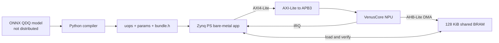

# TinyML_NPU

[English](#english) | 中文

TinyML_NPU 是一个面向研究和教学的 INT8 神经网络加速器参考实现。项目源于毕业设计，目标不是提供可直接商用的 IP，而是公开一条足够小、能够理解、能够修改、也能够在真实 FPGA 上复现的软硬件协同链路。

很多 NPU 示例只展示 RTL 算子或软件模型的一端。本项目保留从 ONNX QDQ 编译、32-byte uOP、参数布局、SpinalHDL NPU、Zynq PS 固件到 ZYBO7010 板级验证的完整边界，使读者能够追踪一个量化网络怎样变成硬件可执行的数据，并看到每层地址、DMA 和计算状态如何对应。

> 当前公开版本是研究原型，不是生产级推理框架或经过安全认证的硬件 IP。

## 项目意义

- **可检查**：编译器、ISA、RTL、驱动和测试向量都在同一个仓库中，没有隐藏的运行时。
- **可复现**：公开脚本能够从 SpinalHDL 生成 Verilog，构建 Vivado/Vitis 工程，并通过 JTAG 读取结构化测试结果。
- **真实闭环**：演示不是空壳寄存器测试。PS 将 KWS bundle 写入共享 BRAM，VenusCore 对 120 个 KWS 样本逐个执行 44 条 uOP，再由 PS 统计 INT8 logits、top1 和分类准确度。
- **适合学习协同设计**：项目把量化布局、片上存储约束、DMA、寄存器控制和固件重定位放在同一个可运行案例里。
- **边界明确**：公开版本只承诺原版 Digilent Zybo XC7Z010 上的 KWS testvector 路径，不隐藏未验证能力。

## 已验证闭环

```text
预生成 bundle.h + KWS testvector
              |
              v
Zynq PS -> 128 KiB shared BRAM -> VenusCore PL NPU
              ^                       |
              +------ output logits <-+
                                      |
                          reference top1 / accuracy / tolerance check
                                      |
                           UART + JTAG result ABI
```

在 `v0.1.0` 发布验收中，原版 Digilent Zybo 上得到：

| 项目 | 实测结果 |
|---|---:|
| FPGA / PL clock | XC7Z010 / 50 MHz |
| KWS uOP 数 | 44 |
| KWS 测试样本 | 120，12 类各 10 个 |
| NPU 版本 | `0x00050000` |
| label accuracy | 117 / 120 = 97.50% |
| reference top1 match | 120 / 120 = 100.00% |
| 最大 INT8 绝对误差 | 0，容差 5 |
| NPU 活跃周期合计 | 67,582,560 cycles |
| 单样本 NPU 活跃周期 | 563,188 cycles |
| 120 样本活跃周期等价值 | 1351.6512 ms @ 50 MHz |
| Post-route WNS | +3.025 ns |
| LUT / FF | 7,328 / 6,738 |
| BRAM tile / DSP | 42 / 7 |

1351.6512 ms 是 120 次 NPU `DEBUG0` 活跃周期计数求和后换算；单样本等价值仍为 11.26376 ms。它不包含 PS 搬运、cache 操作、程序启动、UART 或 JTAG 开销，因此不能直接解释为端到端延迟或吞吐率。完整测量条件见 [验证与结果](docs/verification.md) 和 [v0.1.0 发布记录](docs/releases/v0.1.0.md)。

## 系统组成



默认硬件配置为 1 cluster、4 lanes、每 lane SIMD4、INT8 乘法和 INT32 累加。控制面使用 APB3，DMA 数据面使用 AHB-Lite。ZYBO7010 wrapper 将 Zynq PS 的 AXI4-Lite 控制访问转换为 APB3，并将 NPU DMA 接到双口共享 BRAM。

## 仓库结构

```text
hw/spinal/                  VenusCore SpinalHDL source
sw/compiler/                ONNX QDQ/compiler/runtime subset
fpga/zybo7010/rtl/          AXI/APB and AHB/BRAM board glue
fpga/zybo7010/app/src/      Testvector-only bare-metal firmware
fpga/zybo7010/scripts/      Vivado, Vitis and XSDB batch flows
docs/                       Architecture, ISA, compiler and verification docs
scripts/                    Reproducible project entrypoints
```

生成的 Verilog、Vivado/Vitis 工程和发布二进制位于 `build/`，不会提交到 Git。

## 快速开始

### 开源工具检查

```bash
git clone https://github.com/XuZhanhe-Chi/TinyML_NPU.git
cd TinyML_NPU
make setup
make check
```

`make setup` 在 `.venv/` 安装 Python 开发依赖；`make check` 本身不会安装或修改依赖。也可以先运行 `make env` 查看缺失工具。

### 生成 RTL

```bash
make rtl
```

输出位于 `build/rtl/VenusCoreTop.v` 和 `build/rtl/VenusCoreTopBB.v`。

### 构建并运行 ZYBO7010

需要 Vivado/Vitis 2021.1、Digilent board files、原版 Digilent Zybo 和可用的 JTAG 连接：

```bash
make zybo-bitstream
make zybo-app
make zybo-run
```

脚本优先使用 `XILINX_VIVADO_SETTINGS` 和 `XILINX_VITIS_SETTINGS`，并兼容 `/home/tools/Xilinx/.../2021.1/settings64.sh`。首次构建会把固定版本的 Digilent board files 下载到 `build/deps/`。

成功的结构化输出包含：

```text
TINYML_NPU_VERSION=0x00050000
TINYML_NPU_RESULT code=0 ... samples=120 label_correct=117 ref_top1_match=120 max_abs_error=0
TINYML_NPU_BOARD_PASS
```

详细步骤和故障定位见 [入门指南](docs/getting-started.md) 与 [ZYBO7010 指南](fpga/zybo7010/README.md)。

## 编译器入口

无模型依赖的 smoke bundle：

```bash
cd sw/compiler
../../.venv/bin/python -m examples.hand_written.conv3x3_single_tile \
  --output-dir out/examples/conv3x3_single_tile
```

如果你有自己的量化 KWS ONNX QDQ 模型：

```bash
../../.venv/bin/python -m examples.onnx.compile_kws_qdq \
  --model /path/to/kws_qdq_int8.onnx \
  --output-dir out/examples/onnx_kws_qdq \
  --address-mode offset \
  --post-check-act-base 0x40000000 \
  --post-check-param-base 0x40000000
```

仓库不分发训练代码、数据集或 ONNX 模型。板级演示使用已生成的 `bundle.h` 和可公开的固定测试向量。

## 文档导航

- [入门与工具链](docs/getting-started.md)
- [架构与数据流](docs/architecture.md)
- [硬件微架构与配置](docs/hardware.md)
- [编译器、算子能力与内存布局](docs/compiler.md)
- [uOP ISA、寄存器与 result ABI](docs/isa-and-runtime.md)
- [验证结果与复现边界](docs/verification.md)
- [已知限制](docs/limitations.md)
- [贡献指南](CONTRIBUTING.md) 与 [路线图](ROADMAP.md)

## 范围与许可

v0.1.0 只包含完成 ZYBO7010 KWS testvector 闭环所需的源码。实时音频前端、训练资产、其他 FPGA 平台、芯片物理实现材料及大型生成工件不在本版本范围内。

项目源码采用 [Apache License 2.0](LICENSE)。Digilent board files 不复制到仓库；GitHub Release 中由 Xilinx 工具生成的 `.bit`、`.xsa` 和 `.elf` 另有来源与使用说明，见 [THIRD_PARTY_NOTICES.md](THIRD_PARTY_NOTICES.md)。

---

<a id="english"></a>
## English

TinyML_NPU is an inspectable INT8 neural-network accelerator reference design for research and education. It originated as a graduation project and publishes the complete boundary between an ONNX QDQ compiler, a 32-byte micro-operation ISA, the SpinalHDL VenusCore accelerator, Zynq bare-metal firmware, and a reproducible KWS testvector demo on the original Digilent Zybo XC7Z010.

The project is useful when the goal is to understand hardware/software co-design rather than consume a black-box accelerator. A reader can trace tensor layout and quantized parameters into uOP fields, observe how the PS relocates a bundle into shared BRAM, and inspect the APB3 control and AHB-Lite DMA paths used by the PL core.

The validated v0.1 path executes 120 balanced KWS samples at a 50 MHz PL clock. Hardware top1 matches the VenusCore reference for all 120 samples, label accuracy is 117/120, and total active NPU cycles are 67,582,560. The per-sample active-cycle value is 563,188 cycles, or 11.26376 ms at 50 MHz. These cycle-derived values exclude host setup and I/O overhead and are not end-to-end latency claims.

Start with `make setup && make check`. For the proprietary board flow, install Vivado/Vitis 2021.1 and run `make zybo-bitstream`, `make zybo-app`, and `make zybo-run`. Detailed documentation is primarily Chinese with an English summary in each topic.

TinyML_NPU is a research prototype, not production-ready IP. Source code is licensed under Apache-2.0; generated vendor artifacts and external board definitions have separate notices.
