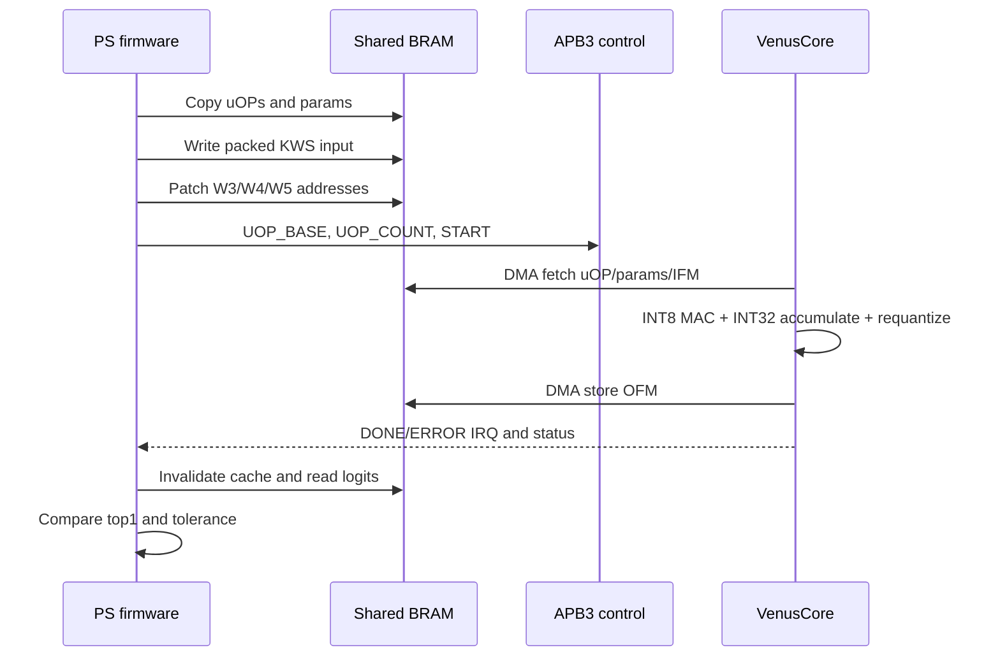

# 架构与数据流

> **English summary:** TinyML_NPU combines a Python compiler, the 32-byte VenusCore uOP ISA, a SpinalHDL accelerator, Zynq bare-metal firmware, and a shared-BRAM board integration. The PS owns bundle loading and verification; VenusCore owns DMA-driven INT8 execution.

## 设计边界

TinyML_NPU 把系统分为四个可独立检查的层次：

1. 编译器把量化网络规范化、切 tile、规划地址，并产生 `uops.bin`、`params.bin`、`metadata.json` 和 `bundle.h`。
2. PS 固件把只读 bundle 复制到 NPU 可见的共享 BRAM，并对 offset-address uOP 的 W3/W4/W5 做运行时重定位。
3. VenusCore 通过 APB3 寄存器接收 uOP 基址和数量，通过 AHB-Lite 主口读取 uOP、激活和参数并写回输出。
4. 板级 glue 把 Zynq PS 的 AXI4-Lite 控制总线转换为 APB3，并把 NPU AHB-Lite DMA 请求转换到 BRAM native port。

这条边界有意保持简单：没有操作系统、动态内存分配、外部 DDR 模型加载或隐藏的硬件驱动层。

## 执行流程



## 公共 RTL 接口

`VenusCoreTop` 保持三类稳定接口：

- APB3 slave：32-bit 数据、12-bit 寄存器地址。
- AHB-Lite master：32-bit 地址和数据，用于 DMA。
- `venus_irq`：完成或错误中断。

生成 Verilog 使用 SpinalHDL 默认端口名：

```text
apb_s_PADDR, apb_s_PSEL, apb_s_PENABLE, apb_s_PREADY,
apb_s_PWRITE, apb_s_PWDATA, apb_s_PRDATA
ahb_m_HADDR, ahb_m_HWRITE, ahb_m_HSIZE, ahb_m_HBURST,
ahb_m_HPROT, ahb_m_HTRANS, ahb_m_HMASTLOCK,
ahb_m_HWDATA, ahb_m_HRDATA, ahb_m_HREADY, ahb_m_HRESP
venus_irq, clk, resetn
```

## ZYBO7010 地址空间

| 区域 | 地址 | 大小 | 所有者 |
|---|---|---:|---|
| NPU control | `0x43C0_0000` | 4 KiB | PS AXI4-Lite -> APB3 |
| Shared BRAM | `0x4000_0000..0x4001_FFFF` | 128 KiB | PS 与 NPU DMA |
| Board result | `0x4001_FFC0..0x4001_FFFF` | 64 B | 固件发布，XSDB 读取 |
| Interrupt | `IRQ_F2P[0]` | 1 bit | VenusCore -> PS |

共享 BRAM 使用双口 RAM：port A 接 PS 的 AXI BRAM Controller，port B 接 NPU bridge。两个端口都运行在 PS `FCLK_CLK0` 的 50 MHz 时钟域，因此当前设计不包含跨时钟 FIFO。

## Bundle 内存布局

固件按 64-byte 边界顺序布置数据：

```text
shared base + 0                           uOP staging
align64(uOP end)                          parameter staging
align64(parameter end)                    activation arena
shared high - 63                          board result block
```

当前 KWS bundle 包含 1,408-byte uOP、58,112-byte 参数和 64,000-byte activation peak；固件在编译期检查其不覆盖 result block。

## 设计取舍

- 使用共享 BRAM 而不是 DDR，减少首版闭环中的 cache、地址翻译和带宽变量。
- 使用 offset-address bundle，使同一个生成工件可以由固件装载到不同物理基址。
- 使用轮询和结构化 result block 同时验证，避免 UART 不可用时失去测试结果。
- glue RTL 优先保证协议行为可检查，而不是追求最大总线吞吐率。

寄存器和 uOP 位域见 [ISA 与运行时](isa-and-runtime.md)，内部缓冲结构见 [硬件说明](hardware.md)。
